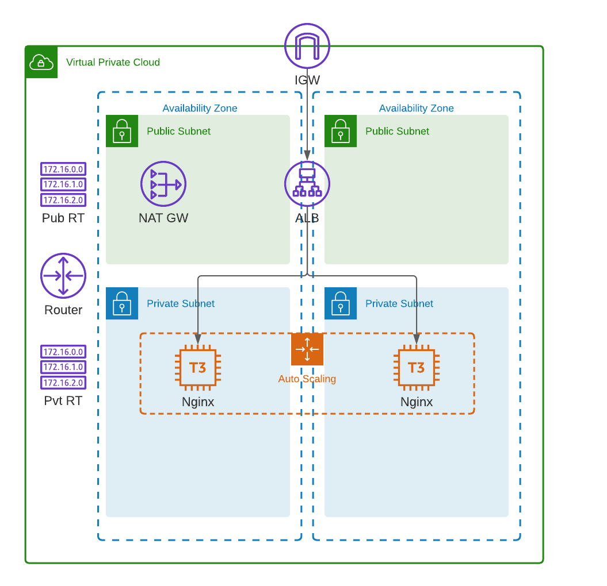

## Exercise AWS
Create an AWS VPC spanning 2 AZs with both public and private subnets. An internet gateway and NAT gateway will be deployed into it. Public and private route tables will be established. An application load balancer (ALB) will be installed which will load balance traffic across an auto scaling group (ASG) of Nginx web servers. Security groups will be created and deployed to secure all network traffic between the components.

## Instructions
- Create your own branch from main
- Make small commits as you progress
- You should not use any terraform module but create every resource step-by-step.
- ALB should expose the Nginx service on port 80 (no TLS required). The default Nginx page should be publicly accessible from the Internet.
- once you have the final solution or part of it (e.g. you can first merge VPC, then the rest of the solution) make a merge request and assign it to Danijel, Tejas and Manuel
- you 